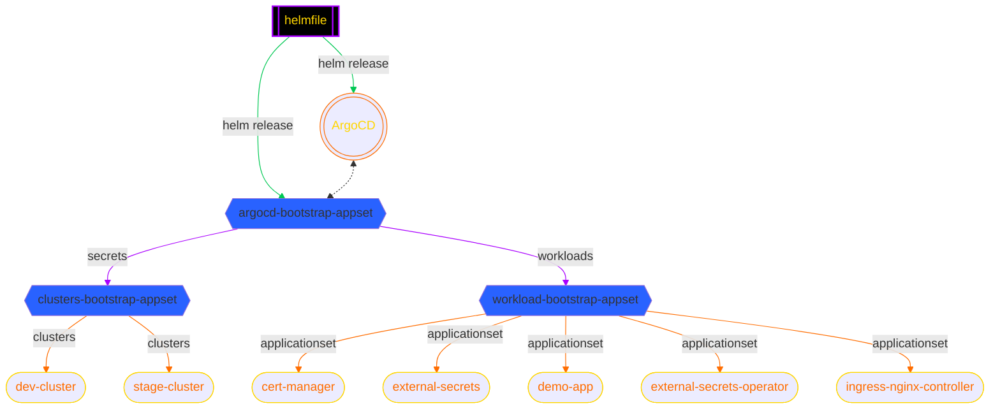

## Special Information

This directory is managed via `argocd` using [argocd-bootstrap-app.yaml](../../helmfile/values/argocd-bootstrap-app.yaml). The bootstrap application uses another applicationset to watch over this directory of applicationsets.

Furthermore these applicationsets configures applications on the basis of [applicationset generators](https://argo-cd.readthedocs.io/en/stable/user-guide/application-set/).

Complete relation ship model is as below:

> :info: Update client IDs and tenant ID in all `values.yaml` and `cluster-issuer.yaml` :info:
