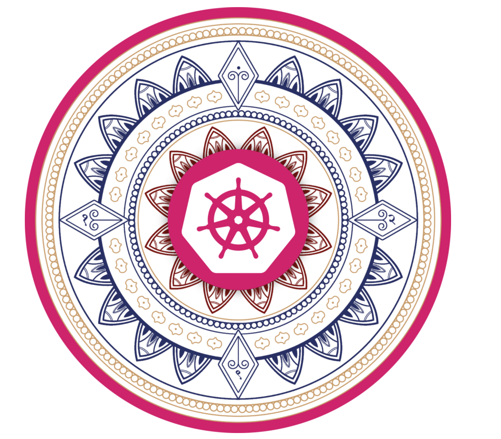

<!-- color: "black" -->

<!-- _paginate: false -->

# Welcome

Welcome to the tech time :rocket: I am Ishan from Special Delivery :star:

>> Please feel free to interrupt me whenever you have question.

---

## Agenda :dart:

- Introduction
- ArgoCD
- ApplicationSets
- Generators
- Demo
- Feedback

---

## Introduction :telescope:

- In this presentation, we will discuss about how to deploy applications in an multi-cluster environment distributed across multiple clouds using ArgoCd and its native operators.

- To illustrate this, we will use a mono-repo similar to [k8s-manifests](https://github.com/work/k8s-manifests)

---
<!-- _color: "black" --> ## slide level color scheme

## ArgoCD

Hi, I am ArgoCD....👋🏻

- ArgoCD is a GitOps continuous delivery tool for Kubernetes.

- It follows the GitOps pattern of using Git repositories as the source of truth for defining the desired application state.

- More at [Argocd Documentation](https://argo-cd.readthedocs.io/en/stable/?_gl=1*vvk4hh*_ga*NTQ3Mzc3Nzc1LjE3MDE0NDI1MTA.*_ga_5Z1VTPDL73*MTcwNDgyMzc2Ny41LjEuMTcwNDgyMzgxNS4wLjAuMA..#overview)

---

## ApplicationSets

- Managed by the ApplicationSet kubernetes controller.
- Used for multi-cluster support and cluster multitenant support within Argo CD.
- It Automates the generation of Argo CD Applications.
- More at [Argocd Documentation: ApplicationSets](https://argo-cd.readthedocs.io/en/stable/operator-manual/applicationset/)

---

## Generators
<!--class: default -->

Generators are responsible for generating parameters, which are then used by the ApplicationSet resource.

- More at [Argocd Documentation: Generators](https://argo-cd.readthedocs.io/en/stable/operator-manual/applicationset/Generators/)

In this demo we are using following generators:
- [Matrix Generator](https://argo-cd.readthedocs.io/en/stable/operator-manual/applicationset/Generators-Matrix/)
<!-- combines the parameters generated by two child generators -->
- [Git Generator](https://argo-cd.readthedocs.io/en/stable/operator-manual/applicationset/Generators-Git/)
<!-- the Cluster generator produces parameters based on the list of items found within the cluster secret. -->
- [Cluster Generator](https://argo-cd.readthedocs.io/en/stable/operator-manual/applicationset/Generators-Cluster/)

...

---

## Demo Time :computer:

We are trying to achieve following goals:

- Establish GitOps and IaC. (everything as configuration and code)
- Dynamic Application Provisioning to multi cluster environments.
- Simplified cloud agnostics configuration management for applications.
- Provide mechanisms for value files in DRY formatt.(Multi level overrides)
- Continuous reconciliation and parrallel deployments.

---

## Feedback :raising_hand:

- Source GitHub Repo : https://github.com/ishuar/argocd-multi-cluster
- Questions and Answers

I am confident that there is plenty of room for improvements, and any feedback or questions are welcome.